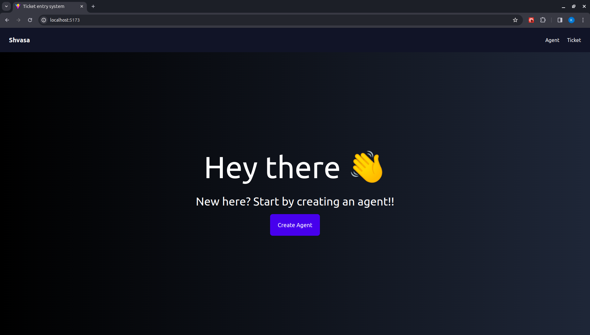
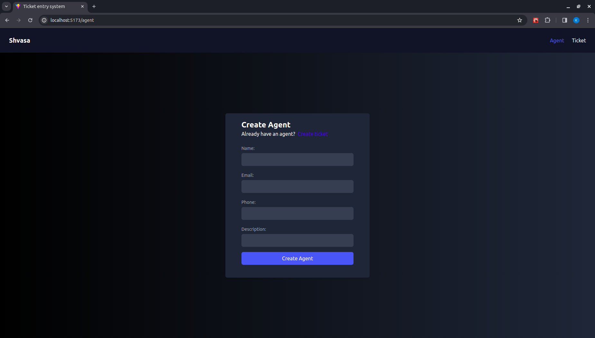
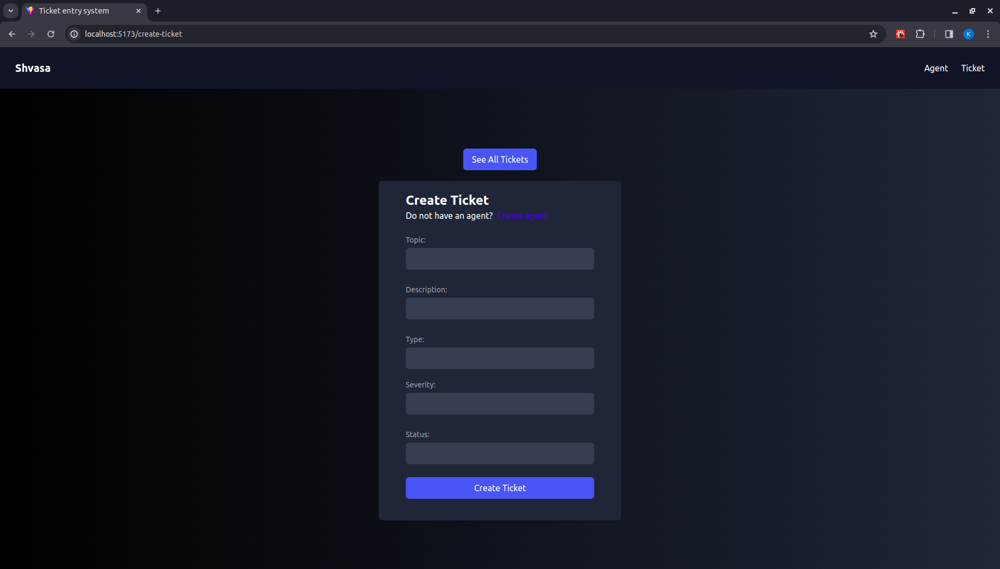
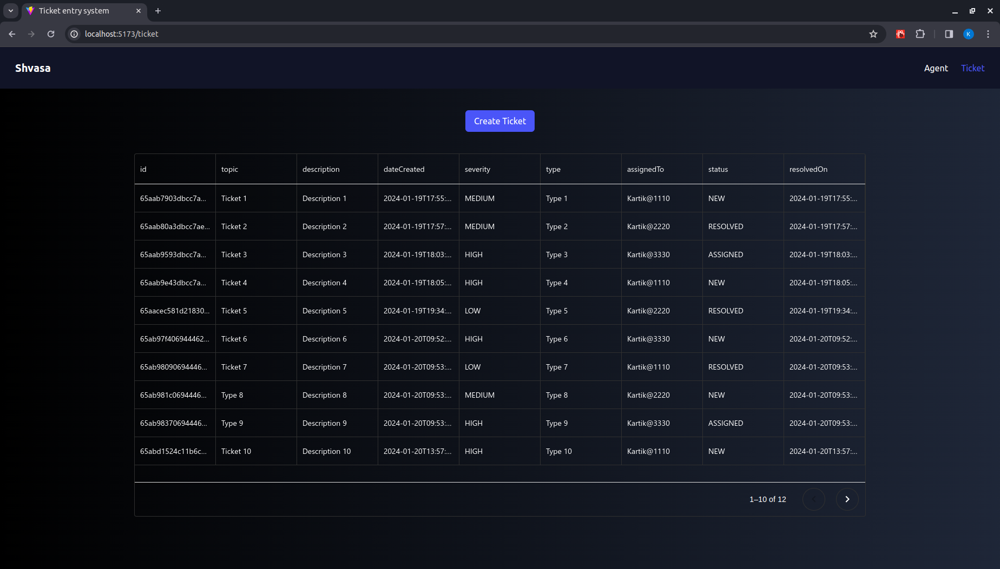

## About this project

This is a full stack support-ticket-entry system.

## Application screens

- Landing screen

- Create Agent screen

- Create Ticket screen

- Ticket screen

## Tech Stack

- [Typescript](https://www.typescriptlang.org/) - Language
- [React.js](https://reactjs.org/) - Frontend
- [Express.js](https://expressjs.com/) - Backend
- [MongoDB](https://www.mongodb.com/) - Database
- [Prisma](https://www.prisma.io/) - ORM
- [Tailwind](https://tailwindcss.com/) - CSS
- [Vercel](https://vercel.com) - Hosting

## Setup this project locally

### Client Setup

- Run 'cd client'
- Add .env file
- Copy .env.example to .env
- Add VITE_API_BASE_URL - URL for backend
- Run 'npm install'
- Run 'npm run dev'

### Server Setup

- Run 'cd server'
- Add .env file
- Copy .env.example to .env
- Add DATABASE_URL - URL for mongodb server
- Run 'npm install'
- Run 'npm run dev'
